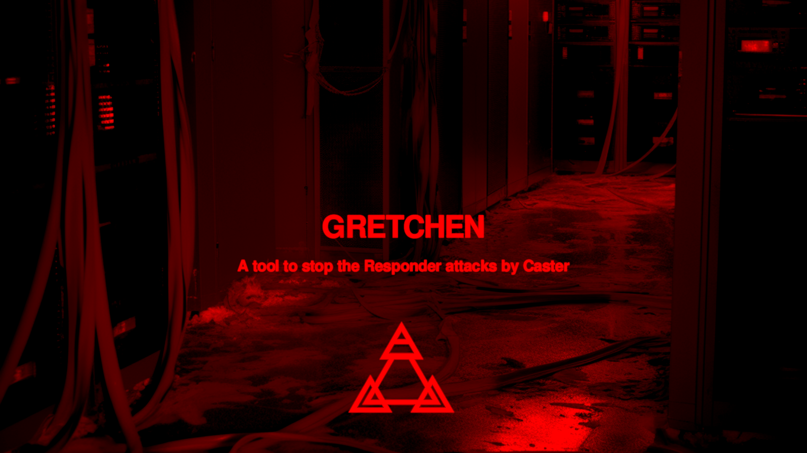
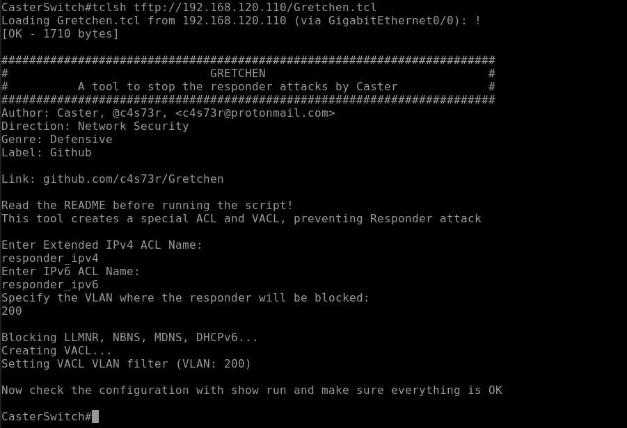
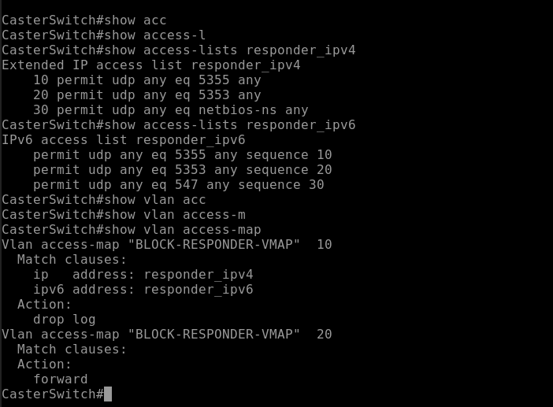
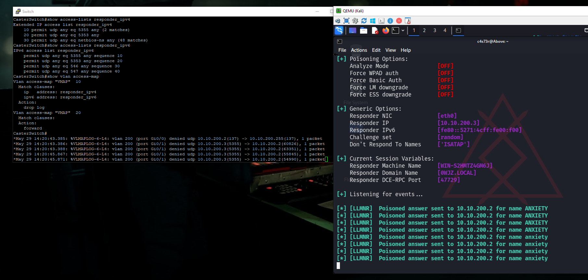

# Gretchen
Cisco TCL tool to stop Responder attacks by Caster
 


## Intro

Gretchen deploys special ACLs, which filter traffic based on the SOURCE port, that Responder uses for the poisoning process itself. The previously created ACL are bound to the further created special VACL maps, then the ACLs themselves installed on VLAN.

The most phenomenon is that this tool is countered only at the network hardware, without Windows, Active Directory configurations.

## Ports

- LLMNR (UDP/5355)
- NBNS (UDP/137)
- MDNS (UDP/5353)
- DHCPv6 (Client Side: UDP/546, Server Side: UDP/547)

## Inputs

This script waits for a few inputs on startup:

- Extended IPv4 ACL Name
- IPv6 ACL Name
- VLAN ID

## Caution

For this traffic filtering you need a full understanding of how your network works, with incorrect ACL configurations you can block legitimate traffic. Study the TCL script carefully before running it. You must know what you are doing.

At the moment there are no problems in the daily operation of Active Directory, but you can always let me know if there are any problems.

## Execution

The TCL script is deployed directly on the Cisco switch. For example, you can run it by pre-loading it from a TFTP server, e.g.
```
CasterSwitch# tclsh tftp://192.168.120.110/Gretchen.tcl
```
## Examples



